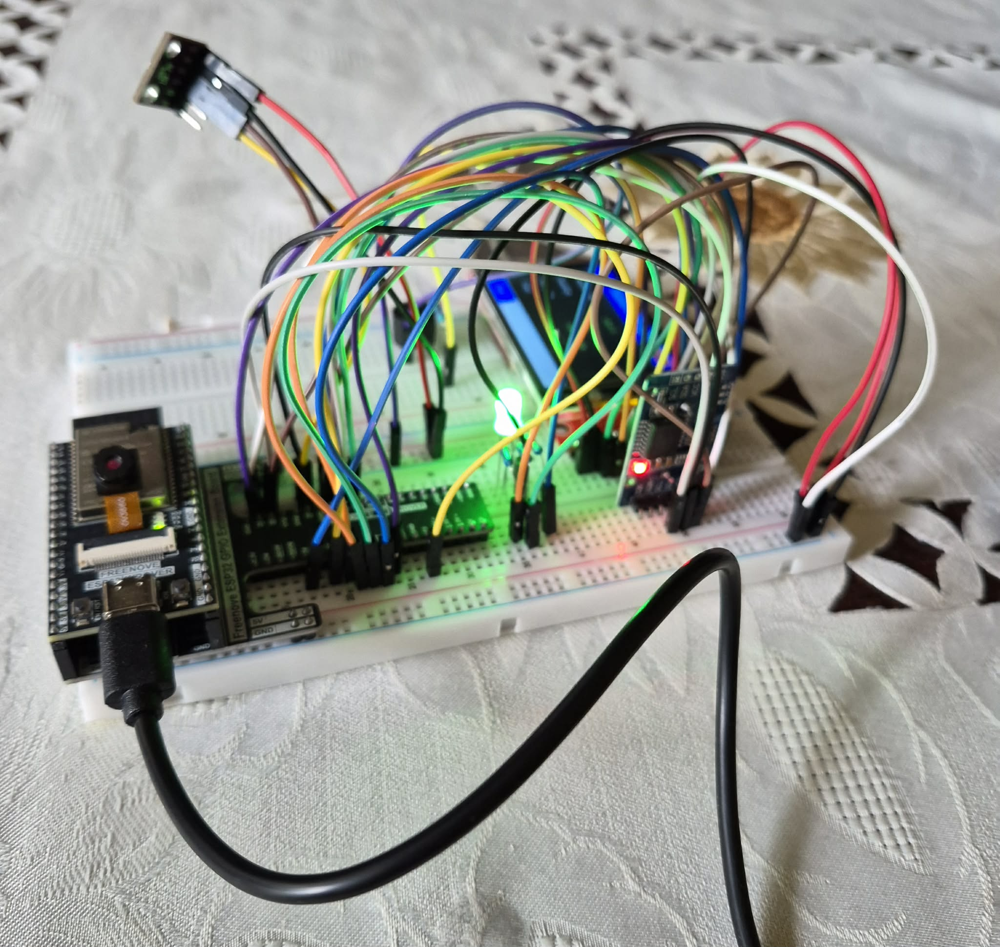
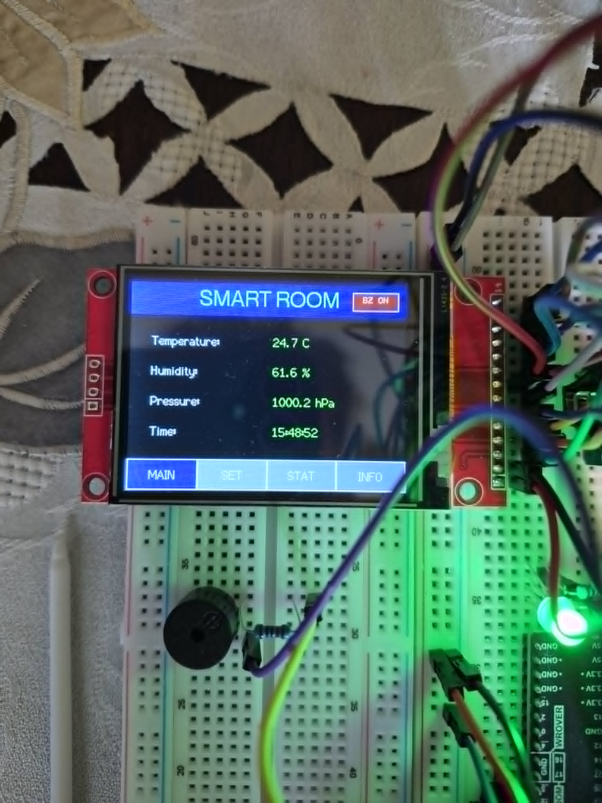
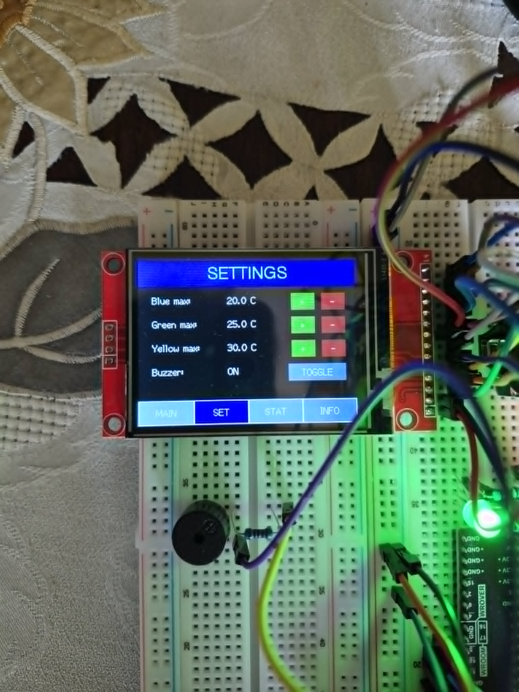
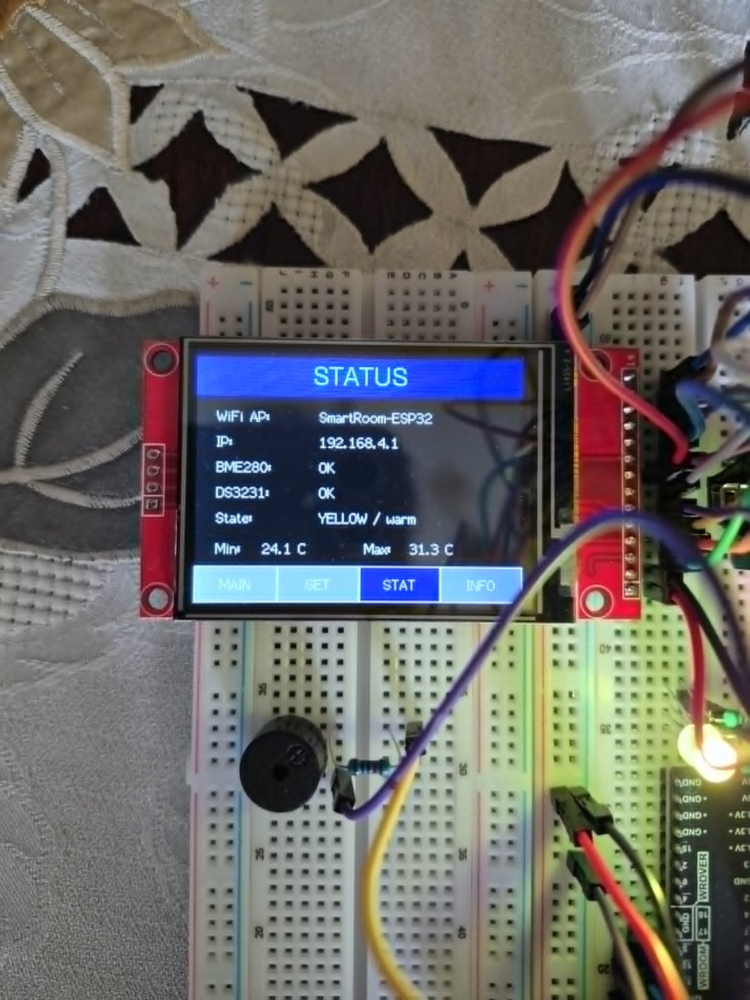
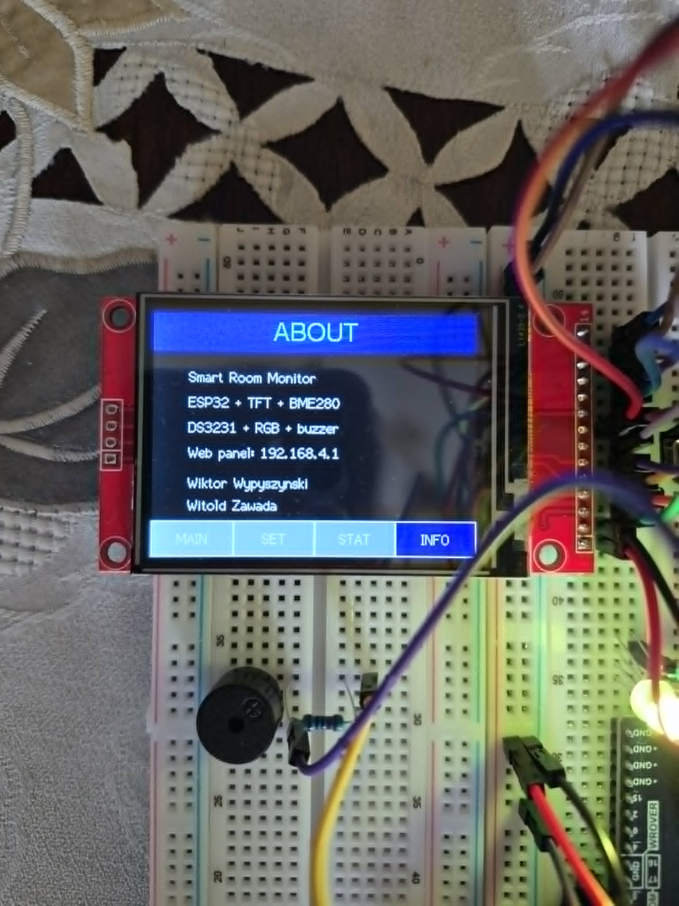
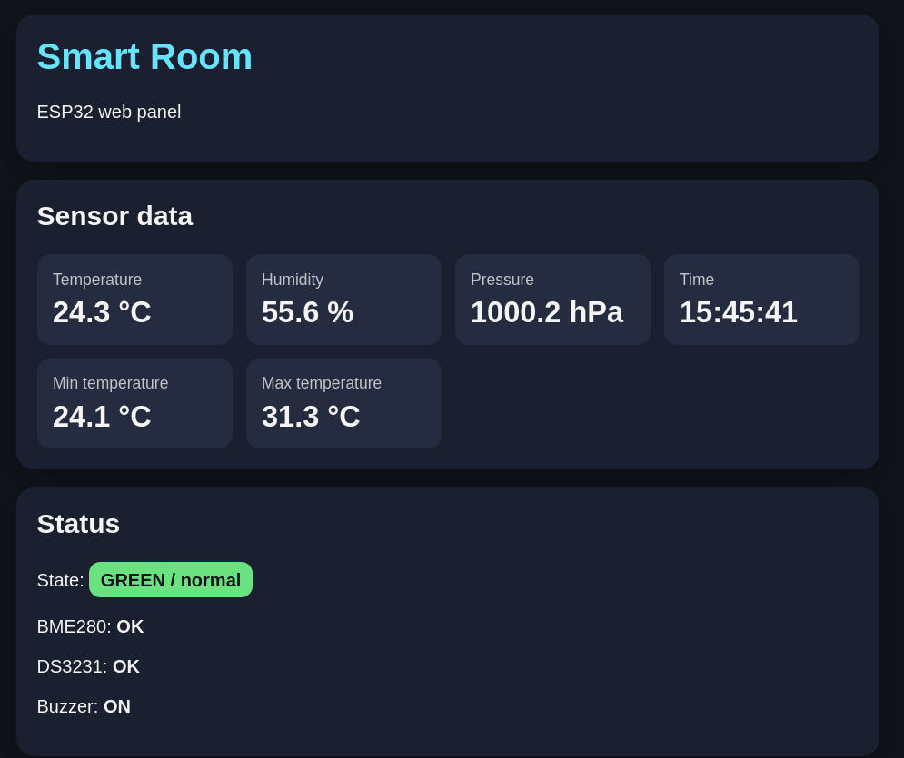
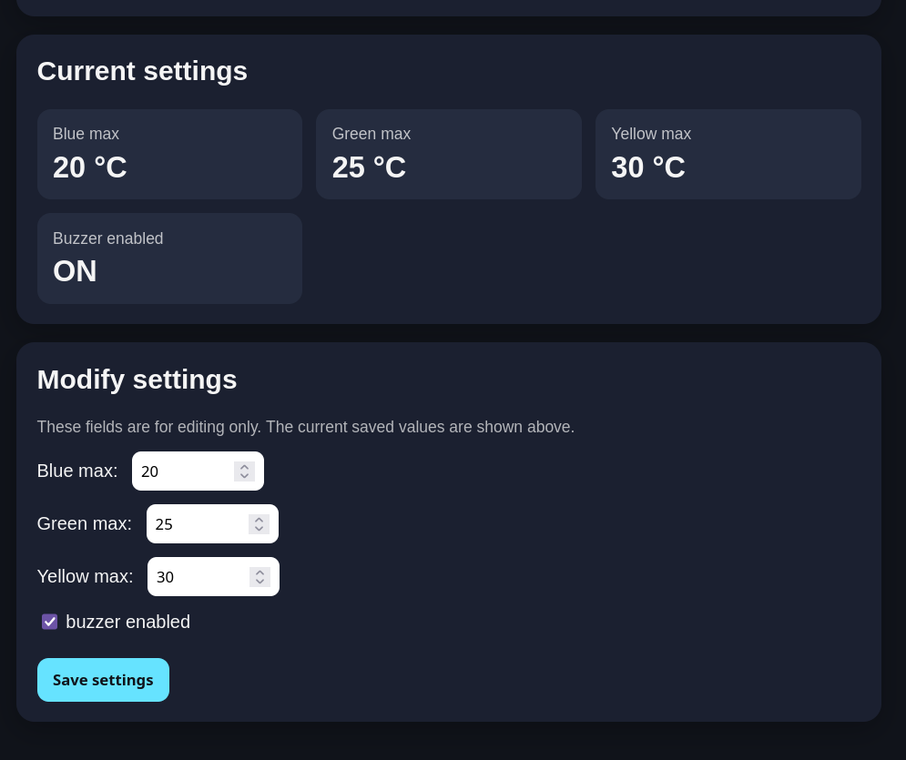
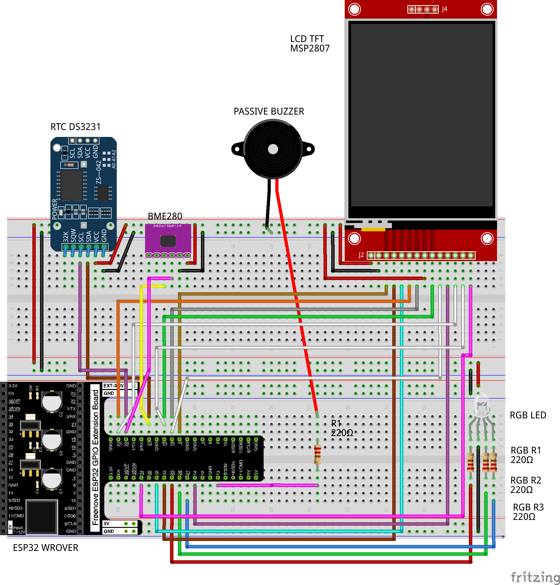

<a id="top"></a>

# ESP32 Smart Room

**ESP32 Smart Room** is an IoT room monitoring panel built with a **Freenove ESP32 Wrover**, a TFT touchscreen, environmental sensors, RTC module, RGB status LED, buzzer alerts and a built-in WiFi web dashboard.

The device monitors room conditions, displays live data locally on the TFT screen and exposes a simple web panel directly from the ESP32 access point.

> Built as a practical ESP32-based smart room monitor combining sensors, touch UI, local alerts and a standalone web interface.

<!-- TABLE OF CONTENTS -->
<details>
  <summary><h3>Table of Contents</h3></summary>
  <ol>
    <li><a href="#features">Features</a></li>
    <li>
      <a href="#demo--photos">Demo / Photos</a>
      <ul>
        <li><a href="#final-build">Final build</a></li>
        <li><a href="#tft-screens">TFT screens</a></li>
        <li><a href="#web-dashboard">Web dashboard</a></li>
        <li><a href="#wiring-diagram">Wiring diagram</a></li>
      </ul>
    </li>
    <li><a href="#hardware">Hardware</a></li>
    <li><a href="#how-it-works">How It Works</a></li>
    <li>
      <a href="#user-interfaces">User Interfaces</a>
      <ul>
        <li><a href="#tft-touchscreen">TFT Touchscreen</a></li>
        <li><a href="#web-dashboard-1">Web Dashboard</a></li>
      </ul>
    </li>
    <li>
      <a href="#wiring">Wiring</a>
      <ul>
        <li><a href="#i2c-bus">I2C Bus</a></li>
        <li><a href="#tft-display-and-touch-controller--freenove-esp32-wrover">TFT Display and Touch Controller</a></li>
        <li><a href="#bme280--freenove-esp32-wrover">BME280</a></li>
        <li><a href="#ds3231--freenove-esp32-wrover">DS3231</a></li>
        <li><a href="#rgb-led-common-anode--freenove-esp32-wrover">RGB LED</a></li>
        <li><a href="#passive-buzzer--freenove-esp32-wrover">Passive Buzzer</a></li>
      </ul>
    </li>
    <li><a href="#software">Software</a></li>
    <li>
      <a href="#tft_espi-configuration">TFT_eSPI Configuration</a>
      <ul>
        <li><a href="#display-driver">Display driver</a></li>
        <li><a href="#color-configuration">Color configuration</a></li>
        <li><a href="#tft-spi-pins">TFT SPI pins</a></li>
        <li><a href="#touch-controller">Touch controller</a></li>
        <li><a href="#loaded-fonts">Loaded fonts</a></li>
        <li><a href="#spi-frequencies">SPI frequencies</a></li>
      </ul>
    </li>
    <li><a href="#setup">Setup</a></li>
    <li>
      <a href="#implementation-highlights">Implementation Highlights</a>
      <ul>
        <li><a href="#non-blocking-buzzer-playback">Non-blocking buzzer playback</a></li>
        <li><a href="#shared-settings">Shared settings</a></li>
        <li><a href="#persistent-configuration">Persistent configuration</a></li>
      </ul>
    </li>
    <li><a href="#authors">Authors</a></li>
    <li><a href="#license">License</a></li>
  </ol>
</details>

---


> [!NOTE]
> This is a compact academic and portfolio-oriented IoT prototype. The code intentionally keeps the whole application in one Arduino sketch to make deployment and review easier.

## Features

- Live temperature, humidity and pressure monitoring
- Real-time clock using the DS3231 RTC module
- Local TFT touchscreen interface
- Built-in WiFi access point
- Web dashboard hosted directly on the ESP32
- Configurable temperature thresholds
- RGB LED temperature status indicator
- Buzzer sound alerts for temperature range changes
- Persistent settings stored in ESP32 non-volatile memory
- Min/max temperature tracking since startup
- I2C and SPI communication in one compact embedded project

<p align="right">(<a href="#top">back to top</a>)</p>

---

# Demo / Photos

<details>
  <summary><strong>Final build</strong></summary>



</details>

<details>
  <summary><strong>TFT screens</strong></summary>

There are 4 TFT screens in total.

#### MAIN



#### SET



#### STAT



#### INFO



</details>

<details>
  <summary><strong>Web dashboard</strong></summary>





</details>

<details>
  <summary><strong>Wiring diagram</strong></summary>



</details>

<p align="right">(<a href="#top">back to top</a>)</p>

---

## Hardware

| Component | Purpose |
|---|---|
| Freenove ESP32 Wrover | Main microcontroller |
| TFT display with XPT2046 touch controller | Local user interface |
| BME280 | Temperature, humidity and pressure sensor |
| DS3231 | Real-time clock module |
| RGB LED, common anode | Temperature status indicator |
| Passive buzzer | Sound alerts |
| Resistors | Current limiting for LED and buzzer |
| Jumper wires / breadboard | Prototyping and wiring |

<p align="right">(<a href="#top">back to top</a>)</p>

---

## How It Works

The ESP32 reads environmental data from the BME280 sensor and time data from the DS3231 RTC module. The current room state is displayed on the TFT touchscreen and can also be checked in the web dashboard.

The RGB LED changes color depending on the current temperature range:

| Temperature range | RGB color | Meaning |
|---|---|---|
| Below blue threshold | Blue | Cold |
| Between blue and green threshold | Green | Normal |
| Between green and yellow threshold | Yellow | Warm |
| Above yellow threshold | Red | Hot |

When the temperature enters a different range, the RGB LED updates and the buzzer plays a short sound alert, unless muted.

Settings such as temperature thresholds and buzzer state are stored using ESP32 `Preferences`, so they are preserved after restart.

<p align="right">(<a href="#top">back to top</a>)</p>

---

## User Interfaces

### TFT Touchscreen

The TFT interface contains four screens:

| Screen | Description |
|---|---|
| `MAIN` | Temperature, humidity, pressure, current time and quick buzzer mute |
| `SET` | Temperature thresholds and buzzer settings |
| `STAT` | WiFi status, sensor status, current state and min/max temperature |
| `INFO` | Project and author information |

Touch input is handled through the XPT2046 touch controller.

### Web Dashboard

The ESP32 creates its own WiFi access point and serves a web dashboard.

| Parameter | Value |
|---|---|
| SSID | `SmartRoom-ESP32` |
| Password | `12345678` |
| Dashboard URL | `http://192.168.4.1` |

The web dashboard allows you to:

- view live BME280 sensor readings,
- check the current RTC time,
- view module status,
- inspect current thresholds,
- change temperature thresholds,
- enable or disable the buzzer.

The dashboard separates live values from editable form fields, so automatic refresh does not interrupt changing settings.

<p align="right">(<a href="#top">back to top</a>)</p>

---

## Wiring

### I2C Bus

The BME280 and DS3231 modules share the same I2C bus.

| Signal | ESP32 GPIO |
|---|---|
| SDA | GPIO21 |
| SCL | GPIO22 |

Typical I2C addresses:

| Module | Address |
|---|---|
| BME280 | `0x76` or `0x77` |
| DS3231 | `0x68` |

<p align="right">(<a href="#top">back to top</a>)</p>

---

### TFT Display and Touch Controller → Freenove ESP32 Wrover

| TFT / Touch pin | ESP32 pin | Notes |
|---|---|---|
| VCC | 3.3V | Power |
| GND | GND | Ground |
| LED | 3.3V | Backlight |
| CS | GPIO5 | TFT chip select |
| RESET | GPIO33 | TFT reset |
| DC | GPIO32 | TFT data/command |
| SDI / MOSI | GPIO23 | SPI MOSI |
| SCK | GPIO18 | SPI clock |
| SDO / MISO | GPIO19 | SPI MISO |
| T_CLK | GPIO18 | Shared with SCK |
| T_CS | GPIO14 | Touch chip select |
| T_DIN | GPIO23 | Shared with MOSI |
| T_DO | GPIO19 | Shared with MISO |
| T_IRQ | GPIO34 | Touch interrupt |

TFT pins are configured in the `TFT_eSPI` library inside `User_Setup.h`.

---

### BME280 → Freenove ESP32 Wrover

| BME280 pin | ESP32 pin | Notes |
|---|---|---|
| VIN / VCC | 3.3V | Power |
| GND | GND | Ground |
| SDA | GPIO21 | I2C SDA |
| SCL | GPIO22 | I2C SCL |
| CSB | Not connected | I2C mode |
| SDO | Not connected | Default module address |

---

### DS3231 → Freenove ESP32 Wrover

| DS3231 pin | ESP32 pin | Notes |
|---|---|---|
| VCC | 3.3V | Power |
| GND | GND | Ground |
| SDA | GPIO21 | Shared I2C SDA |
| SCL | GPIO22 | Shared I2C SCL |

---

### RGB LED, Common Anode → Freenove ESP32 Wrover

| RGB LED pin | ESP32 pin | Notes |
|---|---|---|
| Common anode | 3.3V | Shared LED anode |
| R | GPIO27 | Through resistor |
| G | GPIO26 | Through resistor |
| B | GPIO25 | Through resistor |

The RGB LED is a **common anode** LED, so the project uses inverted control logic.

---

### Passive Buzzer → Freenove ESP32 Wrover

| Buzzer pin | ESP32 pin | Notes |
|---|---|---|
| `+` | GPIO13 | Through 220Ω resistor |
| `-` | GND | Ground |

The passive buzzer is controlled with PWM, which allows it to play simple tones and short melodies.

---

## Software

The project is written for the Arduino ecosystem and uses the following libraries:

- `SPI.h`
- `Wire.h`
- `WiFi.h`
- `WebServer.h`
- `Preferences.h`
- `TFT_eSPI.h`
- `XPT2046_Touchscreen.h`
- `Adafruit_BME280.h`
- `RTClib.h`

Additional dependencies may be required for the BME280 sensor:

- `Adafruit Unified Sensor`
- `Adafruit BusIO`

<p align="right">(<a href="#top">back to top</a>)</p>

---

## TFT_eSPI Configuration

The TFT display uses the `TFT_eSPI` library with a custom configuration prepared for:

```text
ESP32 WROVER + ILI9341 SPI TFT + XPT2046 touch controller
```

This repository includes the exact configuration used in this project:

```text
docs/tft/User_Setup.h
```

To use the same display setup, copy this file into your local `TFT_eSPI` library directory and replace the default `User_Setup.h`.

### Display driver

The project uses the ILI9341 driver variant:

```cpp
#define ILI9341_2_DRIVER
#define TFT_WIDTH  240
#define TFT_HEIGHT 320
```

The screen is used in landscape mode by the application code:

```cpp
#define DISPLAY_ROTATION 1
```

### Color configuration

The display uses BGR color order and inverted colors:

```cpp
#define TFT_RGB_ORDER TFT_BGR
#define TFT_INVERSION_ON
```

### TFT SPI pins

```cpp
#define TFT_MISO 19
#define TFT_MOSI 23
#define TFT_SCLK 18

#define TFT_CS   5
#define TFT_DC   32
#define TFT_RST  33
```

### Touch controller

The XPT2046 touch controller uses a separate chip select pin:

```cpp
#define TOUCH_CS 14
```

The touch interrupt pin is defined in the project code:

```cpp
#define TOUCH_IRQ 34
```

### Loaded fonts

The configuration enables the standard TFT_eSPI fonts and smooth fonts:

```cpp
#define LOAD_GLCD
#define LOAD_FONT2
#define LOAD_FONT4
#define LOAD_FONT6
#define LOAD_FONT7
#define LOAD_FONT8
#define LOAD_GFXFF
#define SMOOTH_FONT
```

### SPI frequencies

```cpp
#define SPI_FREQUENCY       10000000
#define SPI_READ_FREQUENCY  10000000
#define SPI_TOUCH_FREQUENCY 2500000
```

> The `docs/tft/User_Setup.h` file is included as a ready-to-use configuration reference for this exact ESP32 + TFT wiring.

<p align="right">(<a href="#top">back to top</a>)</p>

---

## Setup

### 1. Clone the repository

```bash
git clone https://github.com/PoProstuWitold/esp32-smart-room.git
cd esp32-smart-room
```

### 2. Install required libraries

Install the required Arduino libraries manually in the Arduino IDE.

### 3. Configure `TFT_eSPI`

Copy the provided TFT configuration file:

```text
docs/tft/User_Setup.h
```

into your local `TFT_eSPI` library directory and replace the default `User_Setup.h`.

On Linux with Arduino IDE, the path is usually:

```text
~/Arduino/libraries/TFT_eSPI/User_Setup.h
```

This project uses an `ILI9341_2_DRIVER` setup with BGR color order, color inversion enabled, SPI at 10 MHz and touch SPI at 2.5 MHz.

### 4. Upload the code

Connect the Freenove ESP32 Wrover board and upload the project.

### 5. Connect to the ESP32 WiFi

After startup, connect to:

> [!CAUTION]
> The default access point password is intended for a demo/local prototype. Change it before using the project in a less controlled environment.

```text
SSID: SmartRoom-ESP32
Password: 12345678
```

Then open:

```text
http://192.168.4.1
```

<p align="right">(<a href="#top">back to top</a>)</p>

---

## Implementation Highlights

### Non-blocking buzzer playback

The buzzer logic uses `millis()` instead of long blocking `delay()` calls. This keeps the system responsive while sounds are playing.

During buzzer playback, the ESP32 can still:

- handle the web server,
- process touch input,
- update the TFT screen,
- read sensor data,
- update RTC time.

### Shared settings

Temperature thresholds and buzzer state are shared between the TFT interface and the web dashboard. Changing settings in one interface immediately affects the whole device.

### Persistent configuration

The project uses ESP32 `Preferences` to store:

- blue temperature threshold,
- green temperature threshold,
- yellow temperature threshold,
- buzzer enabled/disabled state.

This makes the configuration survive resets and power loss.

<p align="right">(<a href="#top">back to top</a>)</p>

---

## Authors

- **Witold Zawada** (https://github.com/PoProstuWitold)
- **Wiktor Wypyszyński** (https://github.com/Netr0n07)

<p align="right">(<a href="#top">back to top</a>)</p>

---

## License

This project is released under the MIT License.

You can change the license depending on how you want to share the project.

<p align="right">(<a href="#top">back to top</a>)</p>
